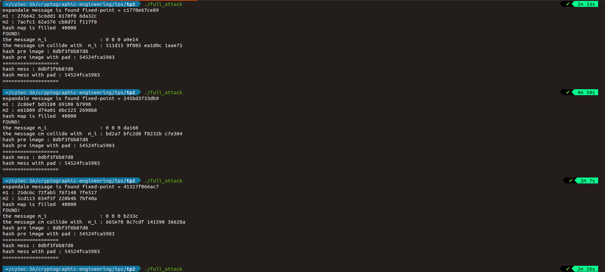

## __The attack__

### Q.1/

In this qyestion I adopt hash map structure because it's has $O(1)\times hashing\_Cost $ in settig a new element and $O(1) \times 2\times hashing\_Cost $ to check and return it if it exist.

I created a hashmap contains $2^{24}$ random message, So given a random message the probability that this message willl not be in hashmap is $1-\frac{1}{2^{24}}$ so in average I will need to create  $3\times 2^{24}$ to find a expandale message in hash map.

So the complexity of this function is :
* $O(1)\times hashing\_Cost \times 2^{26}$ operations
* $O(1)\times 2^{24}$ in memory

In this question we did not use the same hashing function for setting and getting in order to profit the maximumfrom the implementation of hashmap.c

### Q.2/

In average the probability to find an element `cm` such that there is `i` <u> h_i == cs48_dm(m3,fp)</u> is $1-\frac{1}{2^{30}}$ so in average we will need $3\times 2^{30}$ draws. This is true in the case that the generator of numbers is random an uniform.

The complexity of attack() function is :

$C = exp\_mess\_complexity +3\times 2^{30}\times hashing\_Cost$ 

For more details about the code look at attack() function in second_preim_48_file.c file

>N.B : For mess I get a different hash of  0x7CA651E182DBULL.
Some results of performance :

### To Compile 
>gcc -O3 -march=native second_preim_48_fillme.c -o full_attack 
